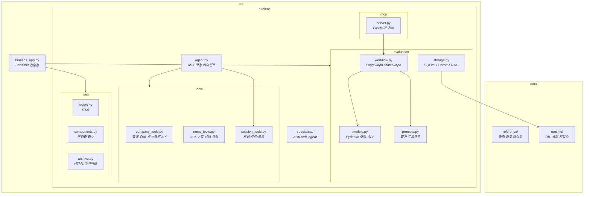

# HireLens

자기소개서를 3인 평가자(HR 담당자, 현업 부서장, 인재개발팀)가 협상 기반으로 평가하고, 코칭까지 연결하는 멀티 에이전트 시스템입니다.


## 주요 기능

- **3인 평가 + 협상** — HR, 부서장, 인재개발팀이 병렬로 독립 평가 후, 판정 불일치 시 최대 3라운드 협상
- **가중 점수 산출** — 역할별 가중치(HR 0.30, 부서장 0.45, 인재개발 0.25)를 적용한 최종 점수 및 판정
- **면접 질문 예상** — 자소서, 평가 결과, 회사 뉴스를 종합한 카테고리별 예상 질문 생성
- **합격 사례 RAG** — Chroma 벡터 저장소에서 업종/직무 기반 유사 합격 사례 검색
- **회사 뉴스 수집** — 네이버 뉴스 API + Google News RSS 병합, 주요 언론사 필터링 후 브리프 생성
- **회사 정보 조회** — KRX 종목 검색 및 토스증권 API 기반 기업 개요·재무 지표 조회
- **AI 코칭** — 평가 결과 기반 문단별 수정 제안, 면접 답변 연습, 수정본 재평가


## 아키텍처

평가 파이프라인은 LangGraph `StateGraph`로 구성됩니다. 3인 평가자가 병렬로 독립 평가를 수행하고, 합의 여부에 따라 협상을 반복합니다.


Streamlit에서 평가가 완료되면 세션 ID(`HL-YYYYMMDD-XXXX`)가 발급되고, 이를 ADK 코칭 에이전트에 입력하면 평가 결과를 이어받아 코칭을 진행합니다. 두 인터페이스는 SQLite 세션 저장소를 공유합니다.


## 기술 스택

| 구분 | 기술 |
|------|------|
| 평가 엔진 | LangChain, LangGraph, OpenAI GPT-4.1 |
| 임베딩 | OpenAI text-embedding-3-small |
| 벡터 저장소 | Chroma |
| 코칭 에이전트 | Google ADK, Gemini 2.5 Flash |
| 도구 연동 | FastMCP (MCP 프로토콜) |
| 웹 UI | Streamlit |
| 데이터 저장 | SQLite |


## 시작하기

### 환경 변수

프로젝트 루트에 `.env` 파일을 생성하세요.

```
GOOGLE_API_KEY=...    # ADK 에이전트용
OPENAI_API_KEY=...    # LangChain 평가 + 임베딩용
```

선택:
```
ADK_MODEL=gemini-2.5-flash   # ADK 에이전트 모델 (기본값: gemini-2.5-flash)
```

### 설치

```bash
python -m venv .venv
source .venv/bin/activate
pip install -r requirements.txt
```

### 실행

**Streamlit (평가 리포트)**
```bash
streamlit run src/hirelens_app.py
```

**ADK (코칭 에이전트)**
```bash
adk web src
```


## 프로젝트 구조


