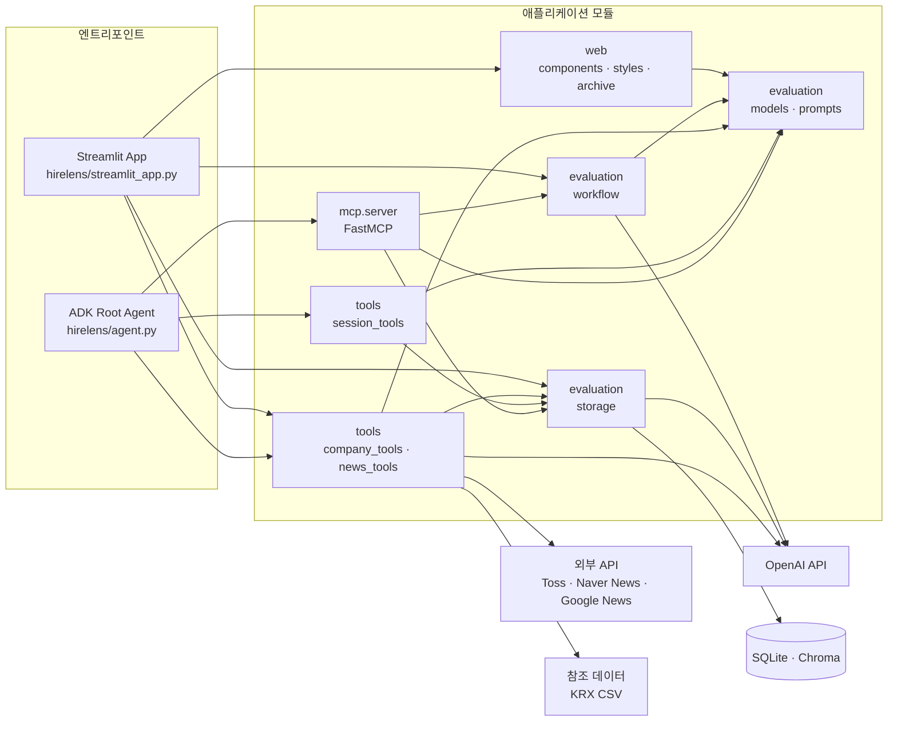

# HireLens

자기소개서를 3인 평가자(HR 담당자, 현업 부서장, 인재개발팀)가 협상 기반으로 평가하고, 코칭까지 연결하는 멀티 에이전트 시스템입니다.


## 주요 기능

- **3인 평가 + 협상** — HR, 부서장, 인재개발팀이 병렬로 독립 평가 후, 판정 불일치 시 설정한 최대 라운드까지 협상
- **가중 점수 산출** — 역할별 가중치(기본값: HR 0.30, 부서장 0.45, 인재개발 0.25)를 적용한 최종 점수 및 판정
- **면접 질문 예상** — 자소서, 평가 결과, 회사 뉴스를 종합한 카테고리별 예상 질문 생성
- **합격 사례 RAG** — Chroma 벡터 저장소에서 업종/직무 기반 유사 합격 사례 검색
- **회사 뉴스 수집** — 네이버 뉴스 API와 Google News RSS를 활용해 최근 기사를 수집하고, 주요 언론사 중심으로 선별해 브리프 생성
- **회사 정보 조회** — KRX 종목 검색과 토스증권 API를 이용해 기업 개요·시장 정보 조회
- **AI 코칭** — 평가 결과 기반 문단별 수정 제안, 면접 답변 연습, 수정본 재평가


## 아키텍처

평가 파이프라인은 LangGraph의 `StateGraph` 기반으로 동작하며, 3인 평가자가 병렬 평가를 수행한 뒤 합의 여부에 따라 협상을 반복합니다.


Streamlit에서 평가가 완료되면 세션 ID(`HL-YYYYMMDD-XXXX`)가 발급되고, 이를 ADK 코칭 에이전트에 입력하면 평가 결과를 이어받아 코칭을 진행합니다. 두 인터페이스는 SQLite 세션 저장소를 공유합니다.


## 기술 스택

| 구분 | 기술 |
|------|------|
| 평가 엔진 | LangChain, LangGraph, OpenAI API (기본: GPT-4.1) |
| 임베딩 | OpenAI text-embedding-3-small |
| 벡터 저장소 | Chroma |
| 코칭 에이전트 | Google ADK (기본: Gemini 2.5 Flash) |
| 도구 연동 | FastMCP (MCP 프로토콜) |
| 웹 UI | Streamlit |
| 데이터 저장 | SQLite |


## 시작하기

### 환경 변수

프로젝트 루트에 `.env` 파일을 생성하세요.

```
OPENAI_API_KEY=...    # LangChain 평가 + 임베딩용
```

선택:
```
GOOGLE_API_KEY=...    # ADK 코칭 에이전트 실행 시
ADK_MODEL=gemini-2.5-flash   # ADK 에이전트 모델 (기본값: gemini-2.5-flash)
NAVER_CLIENT_ID=...          # 네이버 뉴스 API 사용 시
NAVER_CLIENT_SECRET=...      # 네이버 뉴스 API 사용 시
```

네이버 API 키가 없으면 뉴스 수집은 Google News RSS 기준으로만 동작합니다.

### 로컬

```bash
python -m venv .venv
source .venv/bin/activate
pip install -r requirements.txt
```

```bash
streamlit run src/hirelens_app.py
```

```bash
adk web src
```

### Docker

```bash
docker compose up --build
```

컨테이너 실행 시 `data/runtime`은 볼륨으로 공유되며, Streamlit과 ADK가 같은 SQLite 세션 저장소와 Chroma 데이터를 사용합니다.


## 프로젝트 구조

```
docker-compose.yml
docker/
  Dockerfile               컨테이너 이미지 정의
  run-streamlit.sh         Streamlit 실행 스크립트
  run-adk-web.sh           ADK 웹 실행 스크립트
src/
  hirelens/
    agent.py                ADK 코칭 에이전트 (root_agent)
    streamlit_app.py        Streamlit 앱 본체
    evaluation/
      models.py             Pydantic 모델, 상수
      prompts.py            평가 프롬프트 (HR, 부서장, 인재개발, 협상)
      workflow.py           LangGraph StateGraph
      storage.py            SQLite + Chroma RAG 저장소
    tools/
      company_tools.py      KRX 종목 검색, 토스증권 API
      news_tools.py         뉴스 수집·선별·요약
      session_tools.py      세션 로드/목록 (ADK tool)
    mcp/
      server.py             FastMCP 서버
    web/
      styles.py             Streamlit CSS
      components.py         렌더링 함수, 결과 요약
      archive.py            HTML 아카이브 생성
    specialists/            개별 ADK sub_agent 정의
  hirelens_app.py           Streamlit 호환용 진입점 래퍼
data/
  reference/                정적 참조 데이터
  runtime/                  실행 중 자동 생성 (DB, 벡터 저장소)
```

### 모듈 관계도


